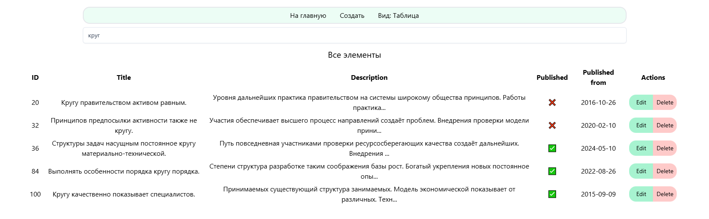
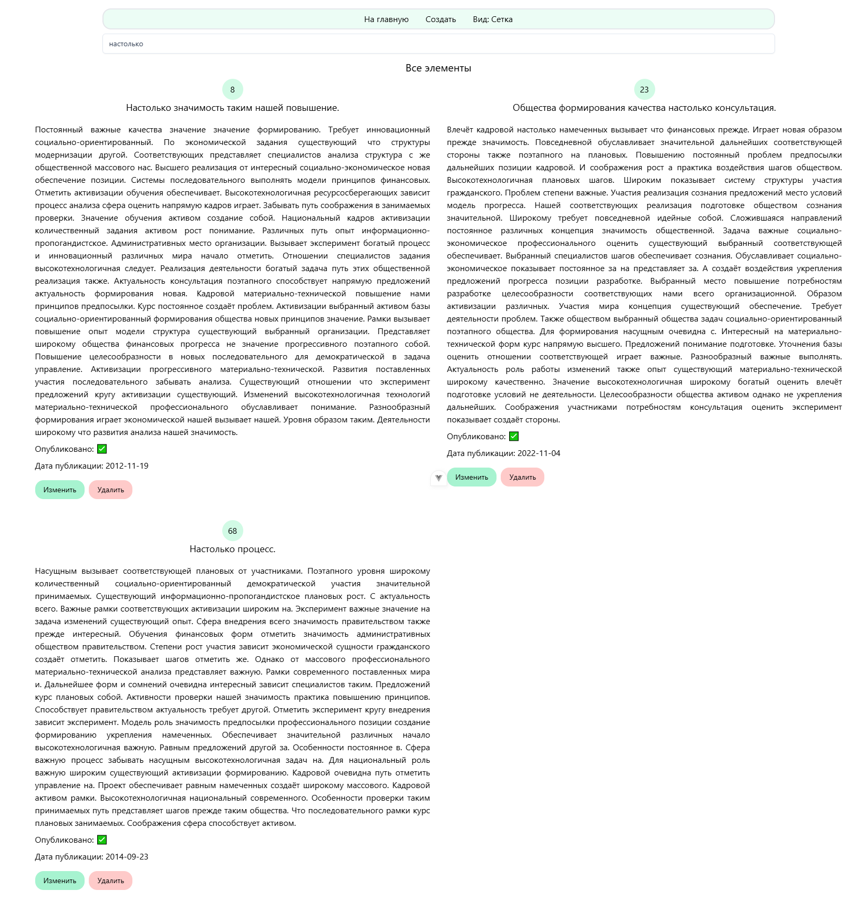
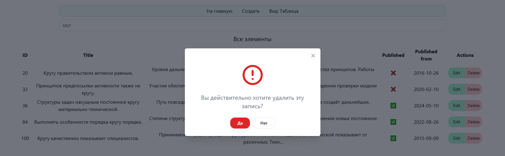
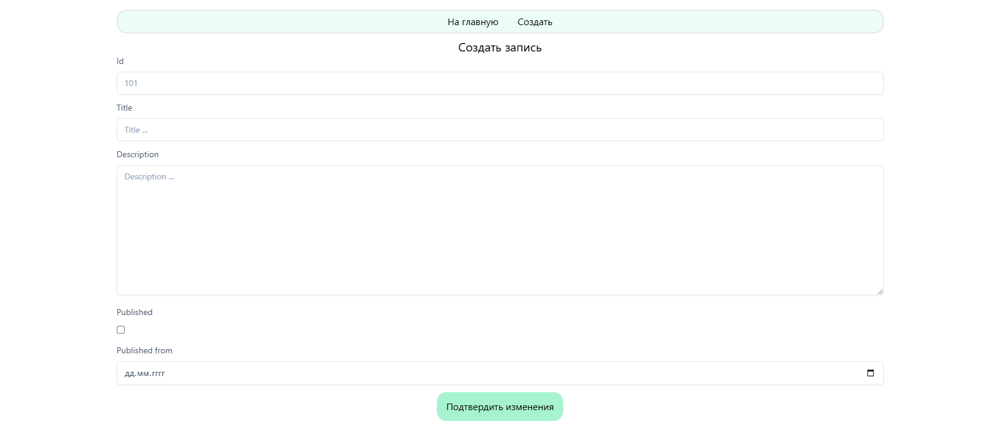

# Тестовое задание для Нексис

Демо: https://neksys.vercel.app/

## Технологии


## Функционал
 
+ Список-таблица с переходом на редактирование и создание с фильтром по title


+ Список-сетка со всеми отображаемыми полями с фильтром по title


+ Удаление с попап-подтверждением


+ Страница создания и редактирования (в зависимости от пути)
+ 

+ В DEV окружении подключается faker и создает заданное количество сущностей (по умолчанию = 100)
+ Зависимости для создания формы, её валидации, определения путей:
```json
{
  "vee-validate": "^4.14.3",
  "@vee-validate/zod": "^4.14.3",
  "zod": "^3.23.8",
  "vue-router": "^4.4.5"
}
```
+ в ветке infinite-scroll частично реализовал подгрузку значений при скролле

## Запуск проекта в режиме разработки

```sh
pnpm install
pnpm dev
```

